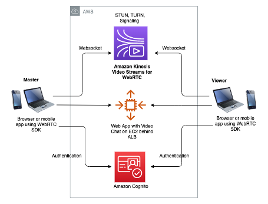

# Amazon Kinesis Video Streams WebRTC SDK for JavaScript with Amazon Cognito

This sample code is derived from [Amazon Kinesis Video Streams WebRTC SDK for JavaScript](https://github.com/awslabs/amazon-kinesis-video-streams-webrtc-sdk-js).

## Summary
[Amazon Kinesis Video Streams for WebRTC](https://docs.aws.amazon.com/kinesisvideostreams-webrtc-dg/latest/devguide/kvswebrtc-how-it-works.html) is a fully managed AWS service that supports thousands of simultaneous video chats, and frees developers from having to procure, set up and maintain their own media servers. This solution allows you to build a basic browser-based video chat application.

## How It Works

## References
[Enabling Video Chats Using Amazon Kinesis Video Streams for WebRTC](https://aws.amazon.com/blogs/media/enabling-video-chats-using-amazon-kinesis-video-streams-for-webrtc/)

## License

This library is licensed under the MIT-0 License. See the LICENSE file.
